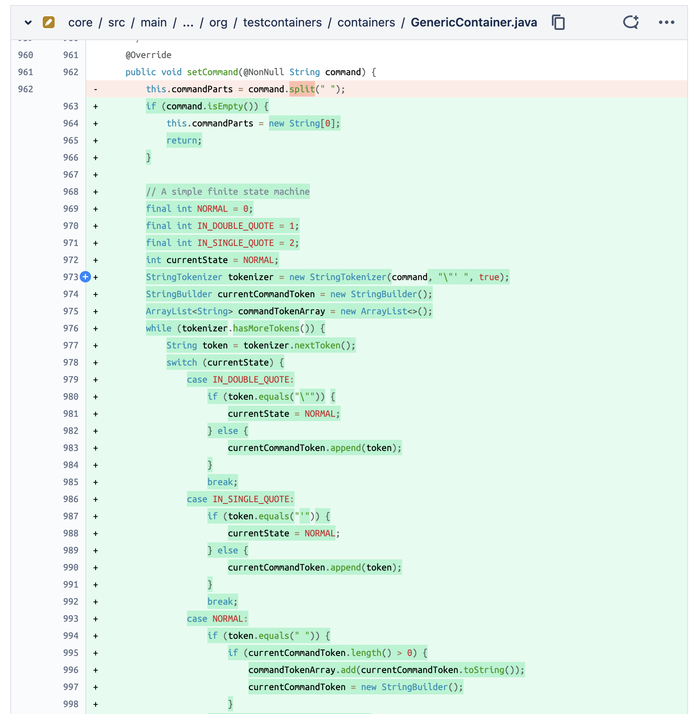
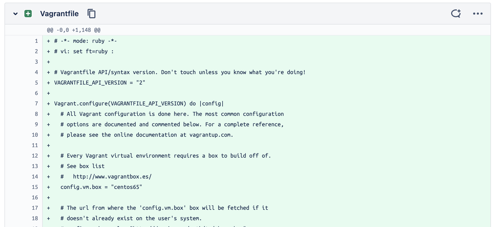
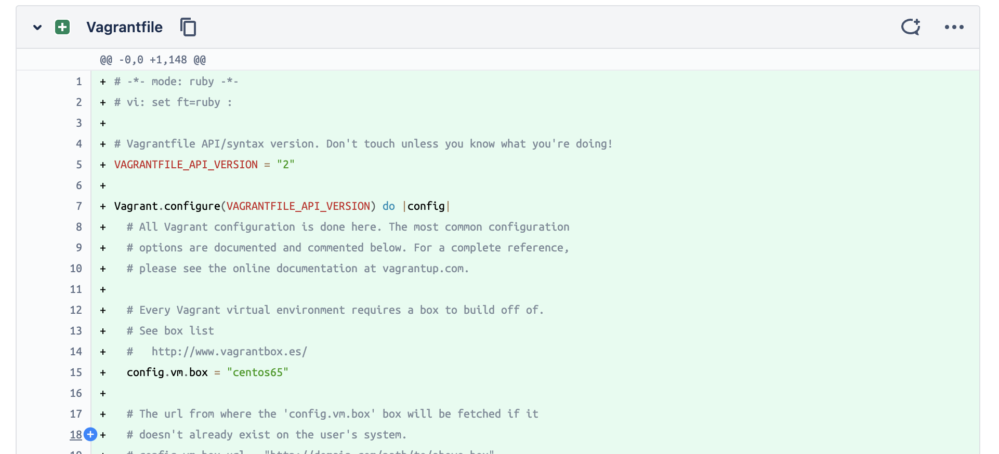

# Bitbucket Syntax Highlighting

A browser extension to add syntax highlighting to your pull requests on Bitbucket.

Syntax highlighting is not supported natively in Bitbucket.
Several users have requested this [feature](https://jira.atlassian.com/browse/BCLOUD-3049), but it has not been implemented yet and the issue is closed.
It is unlikely that Bitbucket will implement this feature, and thus this extension was created.

Syntax highlighting is not just for cosmetics, it's significantly easier to read code when it's highlighted.

🙁 Before:

😄 After:

The latter is easier to review, as there is separation between comments, variables, constants, functions, classes, keywords, etc.
Therefore, this extension will:

- ✅ Decrease the cognitive load of reviewing code
- ✅ Decrease the time it takes to review a pull request
- ✅ Increase the quality of the resulting review. 

Consider for the above examples how difficult it would be to find a bug in the non-highlighted version compared to the highlighted version.

## Usage

The extensions can be found:

- [Chrome Extension](https://chrome.google.com/webstore/detail/bitbucket-syntax-highligh/leaoiajnfhddnijhdljkkdjiajengokn)
- [Firefox Add-on](https://addons.mozilla.org/en-US/firefox/addon/bitbucket-syntax-highlighting/?utm_source=addons.mozilla.org&utm_medium=referral&utm_content=search)

## Supported Languages

See the full list of supported languages
[here](https://prismjs.com/download.html#themes=prism-coy&languages=markup+css+clike+javascript+aspnet+bash+c+csharp+go+gradle+hcl+java+json+markdown+markup-templating+objectivec+php+powershell+python+jsx+tsx+ruby+sql+typescript+visual-basic+yaml&plugins=keep-markup).

Syntax highlighting is done in a best effort manner using the file extension or file name. If there is a language missing or file that isn't highlighted, [please let me know](https://github.com/REslim30/bitbucket-syntax-highlighting/issues/new) or submit a PR.

## Credits
- Kudos to the team at [Prism.js](https://prismjs.com/), for their amazing work on the syntax highlighting library we use.
- Kudos to the team at [Refined Bitbucket](https://github.com/refined-bitbucket/refined-bitbucket), as much of the initial code in this extension was adapted from their extension.
